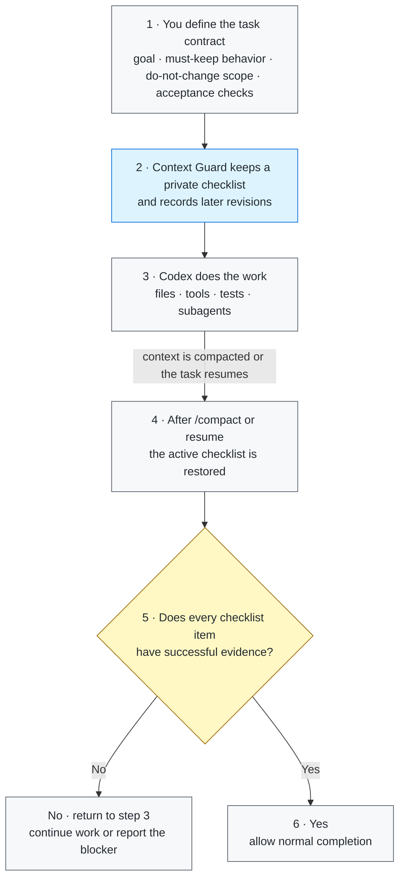

# Context Guard

[](https://github.com/GreenLv/codex-context-guard/actions/workflows/ci.yml)
[](https://github.com/GreenLv/codex-context-guard/actions/workflows/hol-plugin-scanner.yml)
[](https://github.com/GreenLv/codex-context-guard/releases)
[](LICENSE)

[简体中文](README.zh-CN.md)

Context Guard is a local correctness layer for long-running Codex tasks. It
keeps the task's non-negotiable requirements visible across context compaction
and checks that a completion claim is backed by successful evidence.

It does **not** replace Codex compaction, Plan or Goal mode, memories,
subagents, worktrees, or the transcript. Codex owns those systems; Context
Guard adds a bounded recovery and completion-verification layer beside them.

> Release status: `0.7.7` is the latest published release. For protocol
> versions, platform evidence, and release history, see
> [Compatibility](docs/COMPATIBILITY.md),
> [Local acceptance](docs/LOCAL_ACCEPTANCE.md), and the [changelog](CHANGELOG.md).

## Start here

| If you want to... | Read... |
| --- | --- |
| understand the problem and value | [Why it exists](#why-it-exists) and [Core capabilities](#core-capabilities) |
| see the lifecycle at a glance | [How it works in 30 seconds](#how-it-works-in-30-seconds) |
| install and try it | [Requirements](#requirements), [Install](#install-from-a-local-clone), and [Quick check](#quick-check) |
| inspect technical or privacy boundaries | [Architecture](docs/ARCHITECTURE.md), [Privacy](docs/PRIVACY.md), and [Compatibility](docs/COMPATIBILITY.md) |

## Why it exists

A long task can survive compaction while still losing the details that matter
most: an original prohibition, a later correction, an acceptance criterion, or
the fact that a local test did not verify the whole task. A normal summary is
useful context, but it is not an immutable task contract.

Context Guard therefore separates four things:

1. what the user required;
2. what later revisions explicitly superseded;
3. what tools actually produced and whether that outcome was successful;
4. what may safely be claimed complete.

## Core capabilities

The capabilities below are ordered by their importance to task correctness.

| Priority | Capability | What it means in practice |
| --- | --- | --- |
| 1 | **Preserve the task contract** | Requirements, acceptance criteria, prohibitions, and later corrections keep stable identities. A correction supersedes an earlier item explicitly instead of silently rewriting history. |
| 2 | **Require evidence before completion** | Each open item must be covered by successful, compatible evidence. A command that succeeded for the wrong file, UI surface, image, or subset does not close the requirement. |
| 3 | **Recover after compaction or resume** | Before compaction, Context Guard saves a bounded recovery packet. On compact or resume, it restores the active checklist, unresolved items, recent evidence, and the completion rule. |
| 4 | **Keep plans, subagents, and visual work attributable** | It mirrors the latest successful native plan as a read-only index, records bounded subagent contracts/results with provenance, and represents images with hashes and metadata rather than stored image bytes. |
| 5 | **Fail safely and protect private state** | Ambiguous tool output remains `unknown`; damaged or unverifiable state fails closed. Private controls are turn-bound, binary payloads are minimized, and exports are redacted and explicit. |

When a verification boundary can be derived deterministically, Proof protocol
1.0.0 enforces it. Unsupported cases remain visible as `legacy_fallback`
instead of being presented as semantic or pixel-level proof. See
[Architecture](docs/ARCHITECTURE.md) for protocol and lifecycle details.

Stop protocol 1.1.0 keeps completion control turn-bound: an unfinished
disposition is advisory only and cannot force a new turn. It records why the
current turn ended without turning Context Guard into a task scheduler.

## How it works in 30 seconds

```text
1. Activate Context Guard for a synthetic task with two requirements.
2. Continue normal work, then run /compact.
3. The resumed task receives the same bounded requirement checklist.
4. Completion remains blocked until successful evidence covers both items.
```

The demo contains no real prompts, local paths, task state, or plugin data.

## Architecture



Codex still owns the work, compaction, Plan/Goal state, and subagents. Context
Guard carries only the bounded correctness checklist across the context
boundary and checks it before a completion claim is accepted.

See [Architecture](docs/ARCHITECTURE.md) and
[Privacy](docs/PRIVACY.md) for the full boundary.

## What you may see in a guarded task

Context Guard keeps a private, task-local ledger.
These stable IDs may appear in model progress text, but they are not printed in the final user-facing reply:

| Example | Meaning | Practical effect |
| --- | --- | --- |
| `R001` | first requirement captured for this task | stays pending across `/compact` until matching successful evidence is recorded |
| `A003` | third acceptance item captured for this task | is checked independently; a nearby passing test does not silently close it |
| `E####` | successful evidence record | closes an `R`/`A` item only when item, subject, surface, and outcome match |

`R001` and `A003` are local ledger identifiers, not GitHub issues, error codes, or global task numbers.
The same identifier in another task means something else, and the private ledger is never shown verbatim.

Recent acceptance work showed this behavior in practice: a pending `R001` survived a real `/compact` and remained pending until fresh evidence and a valid checkpoint existed.
In another review, source tests passed but an enforced readback obligation was still open.
The agent therefore continued to refer to the requirement instead of declaring the whole task complete.
That is the intended effect: preserve the boundary, rather than make a passing sub-check look like whole-task completion.

## Historical Hook failure modes

The following are real failure classes observed in earlier sessions.
They help explain repeated or surprising Hook interventions. They are not expected success paths, and they do not claim arbitrary semantic verification.

### False completion match

A reply was explaining the hypothetical phrase `may call the task complete after unit tests alone`.
An older classifier matched `the task complete` as a direct whole-task claim.
Stop therefore returned `whole_completion_without_checkpoint`, and the model produced an unnecessary continuation.

Observed Hook feedback, with private IDs and commands redacted:

```text
[Context Guard continuation] The task is not yet safely complete.
Resolve or explicitly report these items.
whole-task completion requires a staged private checkpoint.
```

Versions 0.7.4–0.7.6 added context-aware attribution for current-task assertions,
quotations, hypotheticals, examples, questions, trailing negation, plural claims,
and later actions.

### False remaining-action match

Earlier 0.4.x sessions treated a user handoff, external/policy hold, or deferred
phase as assistant-owned work.
Stop asked for another turn even though the correct boundary was to yield and wait.
The protocol-first design now separates completion authenticity from continuation
control with typed dispositions, safe default yield, and a two-continuation cap.

### Stale versioned Hook path

After a runtime upgrade, an active task still pointed at an older cache.
Stop repeatedly reported that the Hook runtime could not be opened, and the task
could not self-heal in place.

Observed Hook error, with the local path redacted:

```text
python3: can't open file '.../context-guard/0.7.3/scripts/context_guard.py': [Errno 2] No such file or directory
```

Versioned caches are immutable. The installer preserves and archives historical
caches, and upgrades are tested from a fresh task.

A normal bounded continuation means that the turn has not established a safe
terminal boundary—usually because evidence is missing or explicit persistence
still applies. It does not by itself mean that the repository work is wrong.
A repeated identical Hook error, or an intervention that exceeds bounded
correction behavior, is a diagnosis signal.
See [Architecture](docs/ARCHITECTURE.md), [Versioning](docs/VERSIONING.md), and
[Compatibility](docs/COMPATIBILITY.md) for the current boundary and upgrade rules.

## Everyday example: write a technical design document without losing decisions

Imagine you ask Codex to prepare a technical design document for a new service.
The task will span research, revisions, diagrams, and review comments, while
several important decisions have already been approved.

### 1. Initial request

```text
Write docs/design/checkout-v2.md for the new checkout service.

Requirements:
- Keep the approved API and data-flow diagrams unchanged.
- Do not change the public rollout date or add new infrastructure commitments.
- Include sections for problem, design, risks, rollout, and open questions.
- Finish only when every checklist item has evidence from the source notes or review.
```

Context Guard turns those requirements into a private checklist. Codex remains
free to inspect source notes, make a plan, draft the document, run checks, or
delegate bounded subtasks normally.

### 2. A later correction

```text
One more constraint: use the team's RFC template, and give every recommendation
either a source link or an explicit "to verify" label.
```

The correction is appended to the checklist; it does not silently rewrite the
original request.

### 3. The task becomes long and `/compact` runs

After research, drafting, diagram updates, and review comments, the conversation
is compacted. A normal summary might remember “write the design document” while
dropping the approved decisions, RFC template, or source-link rule. Context
Guard restores the active checklist instead:

```text
Still required after compaction:
- Approved API and data-flow decisions remain unchanged.
- No new infrastructure commitments or rollout-date changes are introduced.
- The document follows the RFC template.
- Every recommendation has a source link or a "to verify" label.
- Required sections and open questions are present before completion.
```

### 4. “The document is done” is checked against evidence

Before Codex can finish, each open item still needs captured successful
evidence:

| Checklist item | Example evidence | If evidence is missing |
| --- | --- | --- |
| Approved decisions preserved | a diff check against source notes and review decisions | continue working |
| No new commitments | a claim scan and diff of rollout/infrastructure statements | continue working |
| RFC template followed | heading and order check against the team template | continue working |
| Recommendations grounded | source links or explicit `to verify` labels | continue working |
| Complete document | required sections and links are present | allow completion |

The final reply can then say what changed and cite the checks that passed,
without relying on the post-compaction summary to remember every constraint.

This is a representative document-writing case, not a benchmark or a claim of
semantic proof. Context Guard ensures that requirements remain visible and
that completion is evidence-bound; people still decide whether the document's
recommendations are sound.

## Requirements

- Python 3.10 or newer. The Hook runtime has no third-party dependencies.
- Codex CLI `0.146.0` or newer as the tested minimum baseline. This is a tested
  lower bound, not a promise of compatibility with every future Codex version.
- A supported Codex surface that loads plugins and lifecycle Hooks.

## Install from a local clone

Install from the public GitHub repository:

```shell
git clone https://github.com/GreenLv/codex-context-guard.git
cd codex-context-guard
python3 scripts/manage_plugin.py --apply
```

On Windows, use a Python 3.10+ launcher:

```powershell
py -3.10 scripts\manage_plugin.py --apply
```

The helper:

1. registers this repository as a marketplace;
2. installs `context-guard@codex-context-guard`;
3. verifies that the source and installed cache match; and
4. keeps a SHA-256-indexed archive of installed versions so tasks that already
   loaded an older Hook path can finish safely.

It rejects same-version source drift and fails closed when trusted archive
evidence is missing or damaged. See [Versioning](docs/VERSIONING.md) for the
cache and upgrade contract.

Installing a plugin does not automatically trust its Hooks. Start a fresh
Codex CLI task, open `/hooks`, inspect the eight definitions, and trust them
only if they match this repository. Do not use a trust-bypass flag. Start
another fresh task after installation or Hook changes.

Related official documentation: [package a plugin](https://developers.openai.com/plugins/build/plugins),
[install and use plugins](https://learn.chatgpt.com/docs/plugins), and
[advanced Hook configuration](https://learn.chatgpt.com/docs/config-file/config-advanced#hooks).

## Quick check

In a fresh task:

```text
$context-guard
```

Then run:

```text
context-guard status
context-guard diagnose
```

For a recovery smoke test, start a non-trivial task, use `/compact`, and confirm
that the immediate continuation contains a bounded recovery packet with the
same requirements. A successful local unit test is not by itself proof that a
real compact/resume path worked.

Maintainers can run the isolated installed lifecycle smoke against an installed
cache:

```shell
python3 scripts/smoke_installed.py
```

## User controls

Most users need only the first four controls:

| Command | Purpose |
| --- | --- |
| `$context-guard` or `context-guard on` | activate recovery and completion gating |
| `context-guard off` | disable gating while preserving prompt journaling |
| `context-guard status` | show protected-state counts and the latest decision without raw prompts |
| `context-guard diagnose` | show bounded protocol and diagnostic details without raw prompts or replies |

Advanced handoff controls are explicit writes:

| Command | Purpose |
| --- | --- |
| `context-guard export <path>` | write a redacted handoff in the current project; default: `.codex/context-guard/CONTEXT_HANDOFF.md` |
| `context-guard rollover <directory>` | validate an explicitly prepared successor input and write a non-overwriting handoff plus hash manifest; it never creates or authorizes another task |

Read [Successor Pack Input](skills/context-guard/references/successor-pack.md)
before using `rollover`.

## Observed token overhead

Context Guard adds prompt and recovery context to protected tasks. In a small,
anonymized sample of five completed, tool-heavy desktop tasks using 0.6.1,
direct Hook/recovery context represented about **1.4%** of total tokens; including
plugin-triggered status checks brought the weighted observation to about
**1.5%**. Individual observations were roughly **0.2%–2.1%**, so **about 1%–2%**
is a useful order-of-magnitude estimate for similar long-running work, not a
guaranteed rate.

The share varies with compaction frequency, ledger size, explicit skill loading,
and tool-call density. Token share is also not the same as cost share because
cached input pricing cannot be attributed precisely from local session logs.

## Private data and retention

Plugin runtime data is written under Codex-managed `PLUGIN_DATA`. The direct
CLI fallback exists for isolated development only. Prompt bodies, task state,
evidence summaries, and recovery files are local runtime data and are not part
of this repository.

Ended sessions are eligible for cleanup after 30 days. Redacted exports are
created only when explicitly requested and remain in the selected project, so
the user controls their retention. Never commit plugin data or generated
`.codex/context-guard/` files without reviewing the export.

Exports omit raw prompt files, transcript content, credentials, authorization
headers, URL query values, and plugin-private paths. See
[Privacy](docs/PRIVACY.md).

## Update and uninstall

To update a local clone:

```shell
git pull --ff-only
python3 scripts/manage_plugin.py --apply
```

Plugin source changes require a version bump. The helper retains trusted
archives and live historical caches so already-running tasks can finish on the
code they loaded. See [Versioning](docs/VERSIONING.md).

To uninstall the public plugin and marketplace:

```shell
codex plugin remove context-guard@codex-context-guard
codex plugin marketplace remove codex-context-guard
```

Uninstalling code does not imply deleting private runtime state. Review the
installed plugin's data location before removing it, and retain it if an active
task may still depend on the old Hook path.

## Validation

```shell
python3 scripts/validate_public_repo.py .
python3 scripts/audit_public_tree.py .
python3 -m unittest discover -s tests -p "test_*.py"
ruff check .
```

Repository validation tools are pinned in `requirements-lock.txt`. The Hook
runtime remains standard-library-only and has no third-party dependencies.

The CI matrix covers Ubuntu, macOS, and Windows with Python 3.10, 3.11, 3.12,
and 3.13. Platform claims remain evidence-bounded; see
[Compatibility](docs/COMPATIBILITY.md).

The 0.7.7 release corrects false subject and UI-surface
classification and recognizes a valid structured `view_image` image data URL
as successful visual evidence. Schema, Proof/Stop protocols, and the eight-Hook
wire remain unchanged. Scoped native Windows and macOS source plus isolated
install/lifecycle gates pass; CI and HOL verify the exact public commit and tag
separately and do not substitute for native runtime acceptance.

The 0.7.6 release adds classifier 2.2.0 fixes for plural/quantified completion
claims, first-person reporting, quoted completion language, questions, trailing
negations, and contrastive future actions. Scoped native Windows and macOS
source plus isolated-install/lifecycle gates pass; CI and HOL verify the exact
public commit and tag separately and do not substitute for native runtime
acceptance. Historical and candidate evidence remains in
[Compatibility](docs/COMPATIBILITY.md) and
[Local acceptance](docs/LOCAL_ACCEPTANCE.md), rather than in this quick-start
document.

## Explicit non-goals

Context Guard is not:

- a semantic proof that the implementation is correct;
- a general security sandbox or access-control system;
- a transcript backup or cloud synchronization service;
- a second Plan/Goal controller, agent scheduler, mailbox, or shared workspace;
- a replacement for human review, tests, or acceptance.

Proof protocol 1.0.0 enforces only deterministic obligations displayed for an
`enforced` item. It does not prove arbitrary semantic correctness, interpret
arbitrary pixels, or establish official-source validity; `legacy_fallback`
retains the compatible provenance/outcome gate. Shared multi-agent workspaces
and telemetry remain separate research decisions.

## Contributing and security

See [CONTRIBUTING.md](CONTRIBUTING.md) for development rules. Report sensitive
issues through GitHub Private Vulnerability Reporting as described in
[SECURITY.md](SECURITY.md).

Licensed under the [Apache License 2.0](LICENSE).
